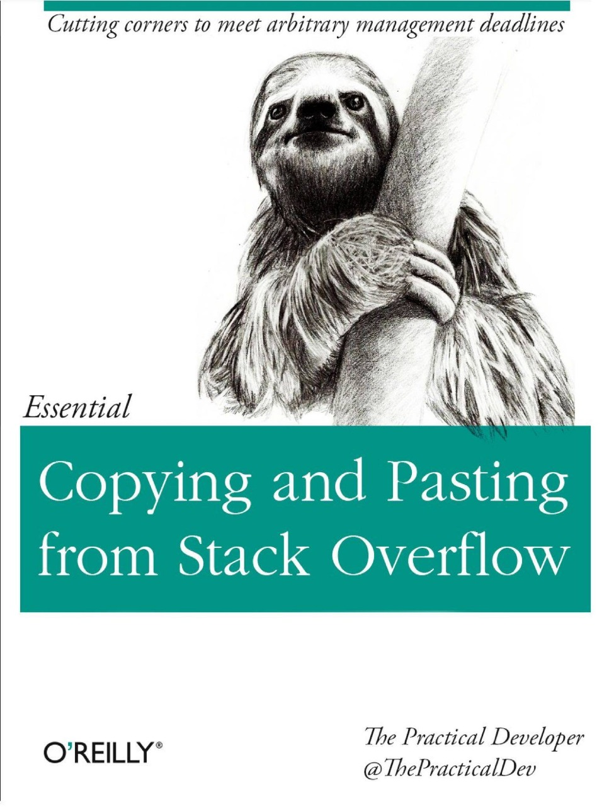

# Machine Learning Intro

**Objective:** Make you understand basic concepts about Machine Learning using Python 3.6 work so you can realize what to look for in official documentation or online.

This workshop is a 10-week course, designed for people familiar with Python 3.6. The objective of the course is to provide you with a basic overview of what Machine Learning is and how can it be applied to financial situations. After taking the course you should be able to understand the basis of machine learning, recognize some of its applications in business, get involved in the development of analytical solutions and develop automatic programs of valuations and price forecasts.

## Table Of Contents

0- Overview

    * The Data Science Process 
    * Machine Learning

1- Pandas

    *   Pandas

        *   What is pandas?
        *   Create DataFrame
        *   Data Ingestion
        *   Viewing and Inspecting Data
        *   Data Cleaning
        *   Data Slicing
        *   Applying Operations over Pandas DataFrame
        *   Aggregation Functions

[Project 1](pandas/project_1.ipynb)

2- Supervised Learning

    * Balance between rigidity and complexity
    * Train and Test Error
    * How to estimate a function?

3-  Regression

    * Linear Regression
    * Standarizing and Normalizing Data
    * Polynomial Regression
    * Logistic Regression

4- KNN

5- SVM

6- Tree Based Models

7- Neural Networks

8- Time Series

9- Make Decisions

## Useful Material

Yves Hilpisch. 2014. Python for Finance: Analyze Big Financial Data (1st ed.). O'Reilly Media, Inc..

**Just joking but remember, this might be a valuable skill in the future**

