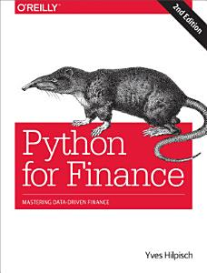

# The Basics

**Objective:** Make you understand basic concepts about how Git and Python 3.6 work so you can realize what to look for in official documentation or in the web.

This workshop is designed for beginers, if you already know some of the topics I encourage you to come only when you think you'll lern new stuff. After every session I will point with an arrow the topic in which we stopped, this way you can know how if the following topics that we are going to cover are interesting for you or not. 

## Table Of Contents

1-  Getting Started <------

[Intro to GitHub](git_intro.md)

        
        *   What is GitHub?
        *   Download Class Repository
        
[Installing Python](inst_python.md)
    
        *   Anaconda
        *   The concept of Environment
        *   Interacting with Jupyter and Spyder

2-  Python Basics

[Programming Basics](basic_python.ipynb)
    
        *   Data Types
        *   Conditionals
        *   Lists
        *   Loops
        *   Built-in-Functions

[Modules](libraries.ipynb) 

        *   Module and Package concept
        *   Installing Modules

3-  Pandas

    *   Pandas

        *   What is pandas?
        *   Create DataFrame
        *   Data Ingestion
        *   Viewing and Inspecting Data
        *   Data Cleaning
        *   Data Slicing
        *   Applying Operations over Pandas DataFrame
        *   Aggregation Functions

4-  Exploratory Data Analysis (EDA)

    *   EDA

        *   Numerical Data
        *   Variation
        *   Distribution
        *   Unusual Values
        *   Outliers
        *   Missing Values
        *   Covariation
        *   Case Study

5-  Real Time Data

    *   API's

        *   Bloomberg API
        *   Yahoo Finance API
        *   Summary Statistics

6-  Financial Analysis

    *   Basic Financial Time Series Analysis

        *   Changes Over Time
        *   Rolling Statistics
        *   Resampling

7-  If we still have time...

    *   In Class Project

## References

Yves Hilpisch. 2014. Python for Finance: Analyze Big Financial Data (1st ed.). O'Reilly Media, Inc..

**Just joking but remember, this might be a valuable skill in the future**

### Previous Classes/Professors/Workshops

Gerard Felipe. 2019. Git: Una Introducción práctica. Workshop at ITAM

