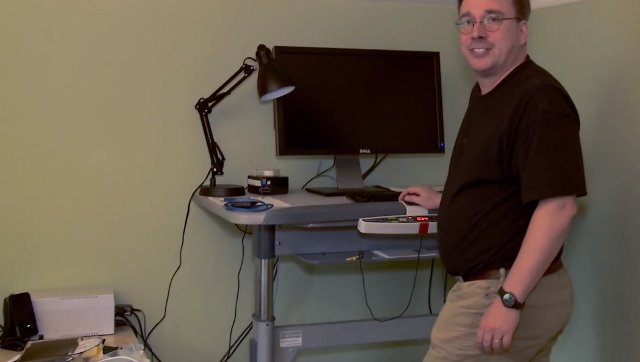
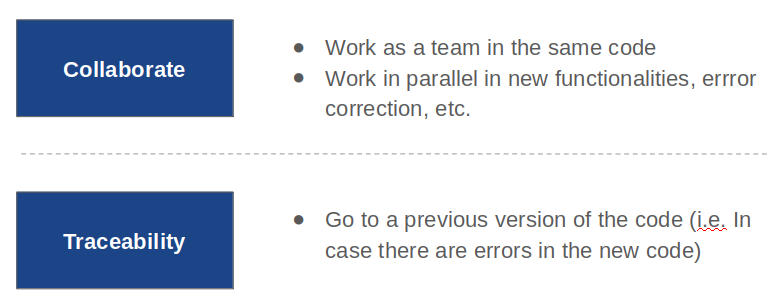
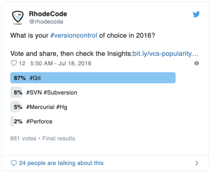

# Git/GitHub Introduction

## 1- Git: Practical Introduction

### 1.1- What is Git?

**Git is** a distributed version-control for tracking changes in time in source code during software development.

We need it because it ~~allows~~ **forces** us to work in an ordered way.

### 1.2- Why do we need a Distributed Version-Control?

### 1.3- Why Git then?

*   Most used distributed version-control (DVC).
*   The majority of Open Source code is on Git.
*   Because it is usefull.
*   There's no serious software/project developed without the use of a DVC and Git is the most popular.

### 1.4- How does it work?

*   Git saves snapshots or _commits_ of the files inside a specific folder.
*   Generates a hidden folder _.git_ where all the versions of our files are saved.
*   While we edit files, we must specify manually when to make a _commit_ and the changes we want to include in it.
*   **Git won't do anything automatically**

## 2- GitHub

*   Online and interactive host of Git.
*   [Microsoft to acquire GitHub for $7.5 billion](https://news.microsoft.com/2018/06/04/microsoft-to-acquire-github-for-7-5-billion/ "Check it out!!!")
*   Share your projects and learn from others! Become great through colaborative knowledge! [Linus TED](https://www.youtube.com/watch?v=o8NPllzkFhE&t=3s)

### 2.1- Create Yours Now!!

*   Go to [GitHub.com](https://github.com/)
*   Sign up
*   Tell me your usernames so I can add you to the class repository 
*   I made this repository private so that the only way to access is having a GitHub account, if you don't create an account you won't be able to follow the material.
*   Once I invited you, go to the repository and Clone or download. (Check if a big majority has Linux/Mac)
*   If you are struggling to clone/download you can always follow the class direcly through GitHub platform.
*   **follow me** if you want :)

